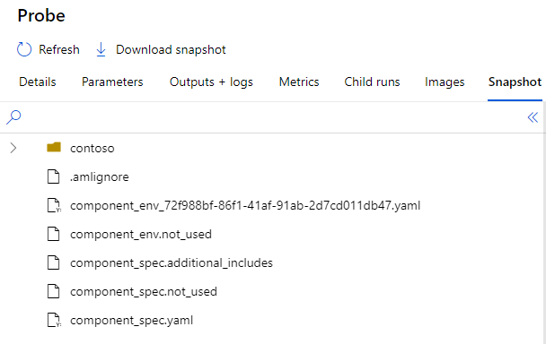

# Submission-time override
## Motivation
A common scenario is when running experiments in different workspaces under different tenants, some fields need to changed accordingly, e.g. `tags` and docker base image. Internally at Microsoft, non-Heron workspaces do not have access to [Polymer Python Package Index](https://o365exchange.pkgs.visualstudio.com/_packaging/PolymerPythonPackages/pypi/simple/), and for Heron workspaces, base images are stored in different registries (`polymerprod.azurecr.io`, `polymerppe.azurecr.io`, `polymerdev.azurecr.io`) for different workspaces (e.g., `PROD`, `PPE`, `public eyes-on`). Users have to modify those fields manually when submitting experiments to a different workspace, which is not an optimal data science experience, and could easily lead to typos and errors.

## Prerequisites
To enjoy this documentation, you should be familiar with [how to create an AML pipeline](./create-aml-pipeline.md) and [how to configure your AML pipeline](./configure-aml-pipeline.md).

## Submission-time override
To allow components to operate across multiple workspaces, we now support submission time override, by which the corresponding fields are modified as user defined and reverted back after submission. The intial RFC (**R**equest **F**or **C**omment) can be found [here](https://github.com/Azure/shrike/blob/main/docs/rfc/pipeline-image-override.md).

### Controlling which components to override
Only components using the "local" copy will be modified at submission time, so you need to define those components in `module_loader.use_local` or set it to `"*"`.

### Adding `tenant_overrides` section to your pipeline yaml
With the additional code block `tenant_overrides`, when you submit an experiment, the `shrike.pipeline` package will check which tenant is being used, and performs the corresponding override.
```yaml
defaults:
- aml: eyesoff
- compute: eyesoff
- modules: module_defaults

run:
  experiment_name: test
  tags:
    accelerator_repo: test

module_loader:
  local_steps_folder: ../../../components
  use_local: "*"

## Adding the following section for this new feature
tenant_overrides:
    allow_override: true    # optional, default = false
    keep_modified_files: false  # optional, default = false
    mapping:
        # MSIT tenant
        72f988bf-86f1-41af-91ab-2d7cd011db47:
            remove_polymer_pkg_idx: true    # optional, default = false
            environment.docker.image:
                polymerprod.azurecr.io/polymercd/prod_official/azureml_base_gpu_openmpi312cuda101cudnn7: mcr.microsoft.com/azureml/openmpi3.1.2-cuda10.1-cudnn7-ubuntu18.04
                polymerprod.azurecr.io/polymercd/prod_official/fake_image: mcr.microsoft.com/azureml/fake_image
            tags:
                workspace: eyeson
        
        personal: # using file name to specify tenant instead of id
            environment.docker.image:
                'polymerprod.azurecr.io/polymercd/prod_official/(.+)': 'polymerdev.azurecr.io/polymercd/dev_official/\g<1>'
```
Under `tenant_overrides`, you could specify three fields:
- `allow_override`: optional, set to `False` by default. This boolean controls whether the submission-time override functionality will be executed or not.
- `keep_modified_files`: optional, set to `False` by default. If `True`, then the modified files (`spec.yaml`, `env.yaml`, etc.) will be saved and renamed as `<filename>_<tenant_id>.<extension>`.
- `mapping`: (nested) dictionary-style definition. If this tenant is being used with `allow_override = True`, then all **local** components will be scanned and the matching fields defined in this `mapping` section will be changed.
    - Keys: `tenant_id` (e.g.: `72f988bf-86f1-41af-91ab-2d7cd011db47`) or "aml configuration" filename in `<config-dir>/aml` (which is also used as in `defaults: aml` in this yaml file).
    - Values: (nested) dictionaries, e.g. `environment.docker.image`. You could define the override for any field in [component schema](https://componentsdk.azurewebsites.net/components.html).
    - For string-type fields such as `environment.docker.image`, the override pattern is "old_value: new_value". For dict-type fields such as `tags`, the pattern is "key: new_value". In the example above, when running under MSIT tenant, the original spec.yaml with
    ```yaml
    tags:
        workspace: eyesoff
    ``` 
    will be overriden as 
    ```yaml
    tags:
        workspace: eyeson
    ``` 
    - The added code should be interpreted as a JSONPath expression, and both "naive" string substitution and regex-based substitution are allowed, e.g.:
    ```yaml
    'polymerprod.azurecr.io/polymercd/prod_official/(.+)': 'polymerdev.azurecr.io/polymercd/dev_official/\g<1>'
    ```
    - `remove_polymer_pkg_idx`: in addition to fields defined in component schema, you could also define this boolean where the default value is `False`. If set to `True`, the index url "https://o365exchange.pkgs.visualstudio.com/_packaging/PolymerPythonPackages/pypi/simple/" will be removed from `environment.conda.conda_dependencies` or `conda_dependencies_file`.


## Summary
In short, to allow submission-time override, 
1. Add component keys or `"*"` to `module_loader.use_local`
2. Add `tenant_overrides` section to pipeline yaml file, with
    - `allow_override: true`
    - nested dictionary `mapping` with tenant_id or "aml configuration" filename as keys
3. Submit your pipeline as usual. In your "snapshot" of the experiment on Azure ML portal, `component_spec.yaml` should be updated, while the original copies are renamed as `<filename>.not_used` (temporarily). The local filenames will be reverted.
Example:
Original code structure on local machine:


Azure ML portal:



Modified code after submission on local machine with `keep_modified_files` set to `False` (if `False`, it will be same as before submission):

